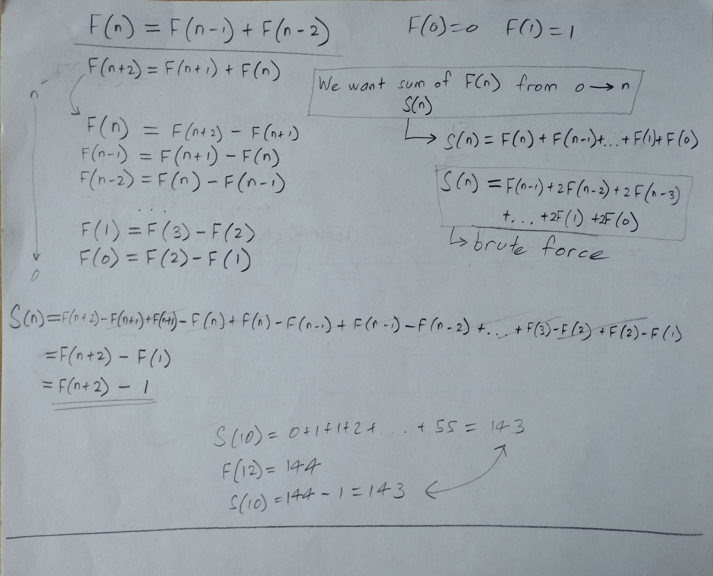

# SOFTENG 282 Assignment 2

Author: Brandon Seng Han Chan
UPI: bcha389
UoA Student ID: 501744077

This Java program calculates the greatest common divisor of the sum of the first A Fibonacci numbers and the sum of the first B Fibonacci numbers. This is done by first calculating the sums, and then using the Euclidean Algorithm to compute the GCD.

The following constraints must be adhered to:
- Should not rely on precomputed Fibonacci numbers
- Should not brute-force compute the Fibonacci series up to the desired number (cannot explictly generate the entire series)

## To compile and run

In the terminal, enter the following to compile the java code and create the jar file:
    javac Main.java
    jar cvfe FibonacciSumGCD.jar Main *.class

This has already been done with the current Main.java code. To run the jar, double-click in the file manager. If that does not work, it can be run from the terminal with:
    java -jar FibonacciSumGCD.jar

## Calculating the nth Fibonacci number

To avoid computing every single number in the series until the nth Fibonacci number, we can instead find an explicit formula for Fibonacci numbers by solving the recurrence relation

a_n = a_(n-1) + a_(n-2)

which can also be written as

a_(n+1) = a_(n+1) + a_n

Referring to pages 43 to 45 in Course book II (Discrete Structures in Mathematics and Computer Science), a solution to recurrence relations of this type can be found of the form a_n = r^n. The following working details this solution:


This solution of the Fibonacci sequence can thus be used for all integers n >= 0.

The method implementing this formula was made to return an integer; this decision means that it will only work between n = 0 and n = 46. Any higher input integer and the maximum value for integers (2147483647) is reached and the method does not work.

## Calculating the sum of the first n Fibonacci numbers

In the above image, the first 10 Fibonacci numbers and the sums at each integer n from 0 to 10 were calculated manually. A pattern can be found in which the sum of the first n Fibonacci numbers is very close to the (n+2)th Fibonacci number.

The following working proves the relationship, in which the sum of Fibonacci numbers from 0 to n can be calculated where like terms cancel out to result in only two remaining terms.



So the sum of the first n Fibonacci numbers is equal to the (n+2)th Fibonacci number minus 1.

The method implementing this formula also returns an integer, and so will only work between n = 0 and n = 44. This is because the method uses the fibonacci method to find the (n+2)th fibonacci number. Since (n+2) will not give the correct answer when more than 46, this method will not work when n is more than 44.

## Calculating the GCD of two numbers

This program uses the Euclidean Algorithm to calculate the greatest common divisor of two numbers n and mm.

If n = m, return n.

Equate n and m to a and b such that a > b.

Let a = qb + r, where r is the remainder of a / b.
If r does not equal 0, let a = b and b = r, and repeat the process.

When r = 0, return b.

## Test/sample output

A test method has been implemented with 4 pre-defined inputs, and more test cases can be added to further test it. This is the output from that method:

Running the algorithm on 4 pre-defined pairs of inputs...

```
4 & 3 => 2
PROMPT: Find the GCD of the sums of the first 4 and 3 Fibonacci numbers.
=========================== STEP 1: Calculate the sums ==========================
Sum of the first 4 Fibonacci numbers = 4
Sum of the first 3 Fibonacci numbers = 2
=========================== Step 2: Calculate the GCD ===========================
GCD(4, 2) = ? (using Euclidean Algorithm)
We use a = qb + r.
a = 4, b = 2 -> r = 0
So return 2.
==================================== ANSWER =====================================
2

30 & 20 => 11
PROMPT: Find the GCD of the sums of the first 30 and 20 Fibonacci numbers.
=========================== STEP 1: Calculate the sums ==========================
Sum of the first 30 Fibonacci numbers = 1346268
Sum of the first 20 Fibonacci numbers = 10945
=========================== Step 2: Calculate the GCD ===========================
GCD(1346268, 10945) = ? (using Euclidean Algorithm)
We use a = qb + r.
a = 1346268, b = 10945 -> r = 33
a = 10945, b = 33 -> r = 22
a = 33, b = 22 -> r = 11
a = 22, b = 11 -> r = 0
So return 11.
==================================== ANSWER =====================================
11

2 & 3 => 1
PROMPT: Find the GCD of the sums of the first 2 and 3 Fibonacci numbers.
=========================== STEP 1: Calculate the sums ==========================
Sum of the first 2 Fibonacci numbers = 1
Sum of the first 3 Fibonacci numbers = 2
=========================== Step 2: Calculate the GCD ===========================
GCD(1, 2) = ? (using Euclidean Algorithm)
We use a = qb + r.
a = 2, b = 1 -> r = 0
So return 1.
==================================== ANSWER =====================================
1

7 & 7 => 20
PROMPT: Find the GCD of the sums of the first 7 and 7 Fibonacci numbers.
=========================== STEP 1: Calculate the sums ==========================
Sum of the first 7 Fibonacci numbers = 20
Sum of the first 7 Fibonacci numbers = 20
=========================== Step 2: Calculate the GCD ===========================
GCD(20, 20) = ? (using Euclidean Algorithm)
20 equals 20, so return 20.
==================================== ANSWER =====================================
20
```

-- end of output --

Each test case matches the pre-calculated values. Not that the 2nd test case (20 & 30) was not manually calculated, and this test case is instead testing the program has used the algorithm correctly.
